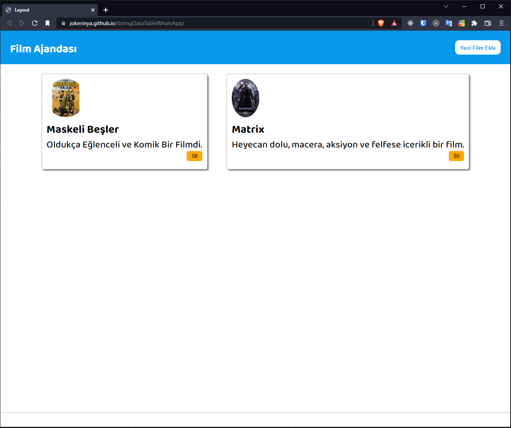

<h1>Basic Film List, DataTable Library and WhatsApp Message Box Library</h1>
This repository consists of some basic study projects.

## 1. Basic Film List

👉This site is online <a href="https://jokerinya.github.io/listingDataTableWhatsApp/" target="_blank">here</a>.

In this project I used,

- VueJs (HTML and CDN, not like a Single Page Application),
- CSS flexbox and grid,
- HTML Modal,
- SCSS.

Basicly user can add a `film name`, a `image link` and a `comment` about the film. I made a `modal for input form` and a `custom form` area. Also user can delete a film, if she wants. There is not a `DB` or `backend technology` for this project (or browser storage like `localStorage`) . All the films has been added wils be deleted when the user refresh the page.

#

## 2. DataTable Library Usage

This is a simple data manipulation application with [jsonplaceholder](https://jsonplaceholder.typicode.com) api. In this project I used,

- VueJs (HTML and CDN, not like a Single Page Application),
- [DataTables Library](https://datatables.net/),
- JQuery,
- Custom data filtering.

Project codes can be seen [here](https://github.com/jokerinya/listingDataTableWhatsApp/tree/master/dataTableSort).

#

## 3. WhatsApp Message Box Library Usage

In this small project, I added a [WhatsApp messanger box](https://github.com/rafaelbotazini/floating-whatsapp).

Project codes can be seen [here](https://github.com/jokerinya/listingDataTableWhatsApp/tree/master/whatsApp-Vue).
